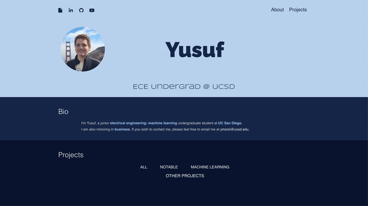

# Portfolio Site
I regularly update this site with information about projects, coursework, and more. This site can be accessed at https://www.ymorsi.com

Below, descriptions and gifs of certain components of this site can be found.

## JavaScript Title Animation

Using [JavaScript](docs/js/main.js), I was able to display my name with the creative animation shown above. 

## JavaScript Project Sorter

Once again using JavaScript, I was able to implement a responsive project sorter. When a user hovers over a project, a bio appears. Pressing on the project leads the user to a new tab with either the Github repository or a YouTube demonstration.

## JavaScript Collapsibles

Once again using JavaScript, I was able to create responsive.collapsible information sections.

## Bonus: Photography Page

As an avid photographer, I love spending my free time adding to my photography collection. While developing my site, I decided to add a [photography page](https://www.ymorsi.com/photography.html).
